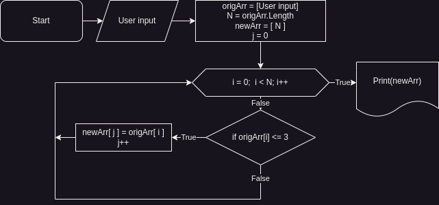

# Итоговая проверочная работа по модулю "Введение в программирование"
## Задача
Написать программу, которая из имеющегося массива строк формирует массив из строк, длина которых меньше либо равна 3 символа.

Первоначальный массив можно ввести с клавиатуры, либо задать на старте выполнения алгоритма.

При решении задачи не рекомендуется пользоваться коллекциями, лучше обойтись исключительно массивами.

## Схема алгоритма

## Описание алгоритма
1. Пользователь вводит массив origArr в виде строк с клавиатуры.
2. Задаем переменную N равной длине введенного пользователем массива origArr.
3. Создаем новую пустой массив newArr длиной N.
4. Задаем переменную j равную 0.
5. Цикл. Задаем переменную i равную 0. Повторяем цикл пока i меньше N. Каждую итерацию i = i + 1.
    1. Для каждого элемента массива origArr[i]. Условие. Если длина элемента мешьше либо равна трем, добавляем его к массиву newArr под индексом j. Делаем j = j + 1.
    2. После перебора всех элементов в массиве origArr, завершаем цикл.
6. Выводим массив newArr на экран.
